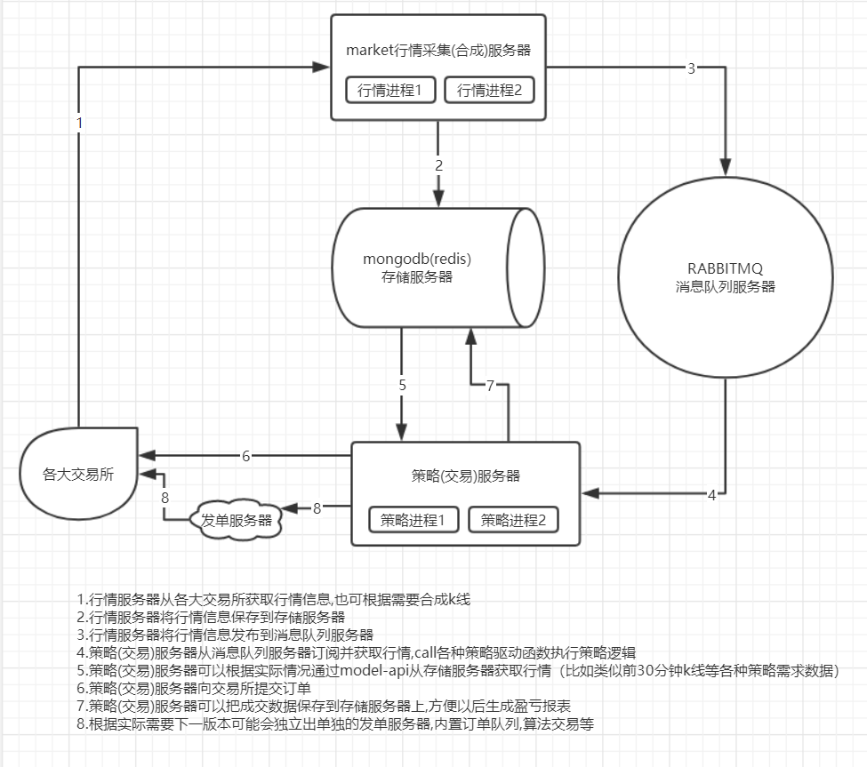
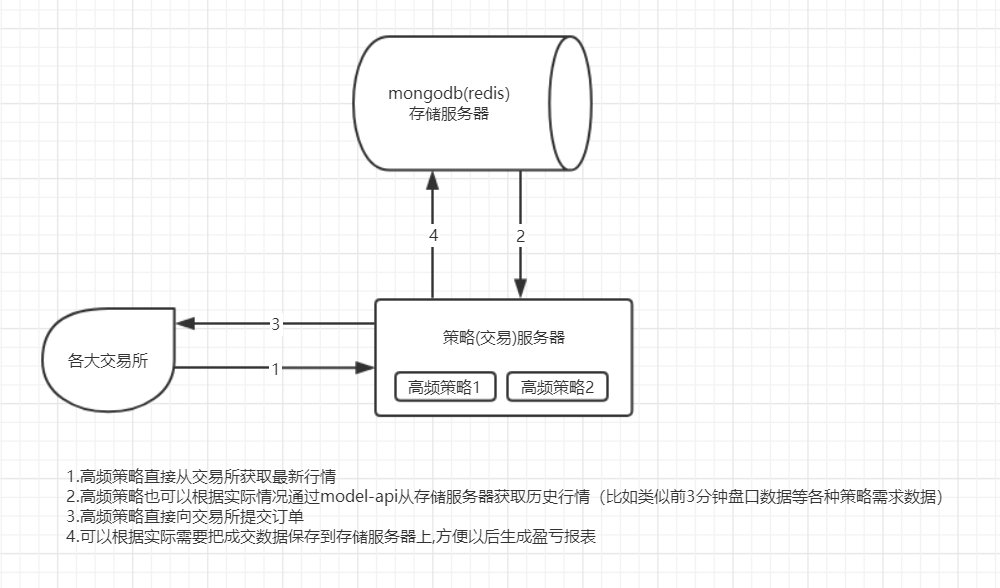
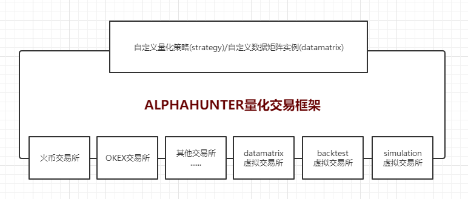

## alphahunter

面向策略对象的异步事件驱动量化交易/做市系统/策略研究/策略回测。
本系统实现数据采集，存储，推送，研究，仿真模拟，线上模拟，实盘等全流程量化研究交易支持，各步骤规则，配置，接口高度统一，异步框架提高系统综合性能


### 框架依赖

- 运行环境
   - python 3.5.3 或以上版本

- 依赖python三方包
   - aiohttp>=3.2.1
   - aioamqp>=0.13.0
   - motor>=2.0.0 (可选)

- RabbitMQ服务器
    - 事件发布、订阅

- MongoDB数据库(可选)
    - 数据存储


### 安装
使用 `pip` 可以简单方便安装:
```text
pip install alphahunter
```


### 目录说明

- 文件夹:

  ./quant 量化基础框架

  ./example 量化策略模板示例

  ./collect 市场行情采集服务
  
  ./datamatrix 包含一些datamatrix示例。
    
  ./backtest 包含一些策略回测示例。
  
  ./notebook 存放策略研究相关文件,如.ipynb文件
  
  ./web 量化交易接口API(纯websocket版),利用此接口可以支持C/C++,Go,Java,Javascript等语言进行策略开发 [查看文档](docs/webservice/API(pure_webscoket).md)

- 快速体验
    [实盘Demo](example/)
    [回测Demo](backtest/)
    [数据矩阵Demo](datamatrix/)


### 框架说明

本框架使用的是Python原生异步库(asyncio)实现异步事件驱动，所以在使用之前，需要先了解 [Python Asyncio](https://docs.python.org/3/library/asyncio.html)。

本框架利用面向对象思想和面向接口编程思想抽象出一个策略基础类 `Strategy`和一个交易所网关回调接口类`ExchangeGateway.ICallBack`,所有量化策略都需要继承自 `Strategy`基类并且实现 `ExchangeGateway.ICallBack`接口, `Strategy`自带了一个数据管理器 `PortfolioManager`用于统一缓存并管理相应策略的仓位,订单,资产,成交等信息。在策略中可以利用 `Strategy.create_gateway`创建指定的交易所网关与交易所建立连接进行交易,所有交易所网关类都需要继承自 `ExchangeGateway`并且实现其中的抽象方法。然后利用设计模式中的工厂模式和代理模式思想实现了 `Trader`类,统一对各交易所进行创建和管理,在策略中调用 `Strategy.create_gateway`,其实其内部就是利用 `Trader`类创建指定的交易所网关与之建立连接，进行交易。

关于中低频基础框架如下图所示：


关于高频基础框架如下图所示：


关于策略研究回测基础框架如下图所示：


alphahunter量化全流程如下:

1.数据清洗与存储. 
  描述：第三方数据，经过清洗，预处理，依据标准格式存储到数据库。
       数据种类分为: 行情数据，另类数据。
       当前的行情数据包括: 订单簿数据，成交数据，K线数据。
       另类数据包括: 地址转账数据，新闻数据，微博数据，论坛数据。（下一步开发）

2.数据矩阵生成. 
  描述: 使用DataMatrix框架和系统自带DataMatrixAPI，实现自定义DataMatrix编写。数据矩阵生成内容包括研究人员所需预测变量时间序列，根据数据库标准存储，根据不同模型参数遍历数据库迭代生成的行情指标时间序列，另类事件拟合指标时间序列等预测数据。最后以csv文件输出数据矩阵执行结果。

3.信号研究. 
  描述: 研究人员把数据矩阵生成csv导入自己的研究环境(比如Jupyter Notebook)，根据预先产生的初级信号，根据其分布特性，组合特性，使用不同的统计方法，实现对待预测时间序列变量的迭代预测。此过程涉及到数据的再清洗，方法选择，模型选择，信号组合等过程。最终根据数据矩阵的可使用变量按照某种方式生成合成变量，对待预测变量有统计显著的预测效果。

4.策略实现. 
  描述: 根据信号研究过程产生的合成信号，实现策略实施，将合成信号转变为可交易的策略内容。表现形式涉及但不限于: 统计套利，CTA，多因子等不同类型策略。

5.策略仿真模拟. 
  描述: 启动仿真模拟（策略回测）平台，针对上一步骤实施的策略实现tick级别或者K线级别仿真模拟，利用数据库历史行情数据，策略模拟过程中，配置策略使用的不同参数配置，最终根据收益率，波动率，夏普率，回撤，换手率等多重指标，评定策略在不同参数配置下的不同表现，选取超参数平面上策略表现稳定区域，确定最终模型。

6.策略线上模拟。
  描述: 将第5步骤完成的策略部署到线上，启动线上模拟平台实现实盘模拟，通过配置策略所需数据等系统支持运行环境，实现订单线上模拟撮合引擎成交，并监控策略线上模拟表现情况。线上环境数据支持依据策略实际情况，包括但不限于实施tick数据，订单薄数据，成交数据，K线数据，或者另类数据实时推送等需求。（下一步开发）

7.策略实盘.
  描述: 将第5步骤完成的策略部署到线上，实现实盘交易。同6，线上环境数据支持依据策略实际情况，包括但不限于实施tick数据，订单薄数据，成交数据，K线数据，或者另类数据实时推送等需求。

8.策略线上模拟和实盘交易表现监控与预警。
  描述: 策略线上模拟和实盘过程中，需要对应表现监控与极端情况预警支持，具体表现形式根据策略类型不同而单独配置。

**当用户想要进行信号研究的时候可以编写DataMatrix代码通过量化框架接入到底层DataMatrix处理器(类似虚拟交易所)。**  
**当用户写好策略想要进行策略回测的时候,可以将编写好的策略代码通过量化框架接入到底层backtest虚拟交易所(内部实现了回测功能)。**  
**当用户写好策略想要进行线上模拟的时候,可以将编写好的策略代码通过量化框架接入到底层simulation虚拟交易所(内部实现了线上模拟的功能)。**  
**当用户写好策略想要进行实盘的时候,可以将编写好的策略代码通过量化框架接入到底层真实的交易所(比如火币,OKEX等)。**  
如下图所示：  


- 当前支持交易所
    - [FTX](example/ftx)
    - [火币现货](example/huobi)
    - [火币期货](example/huobi_future)
    - [OKEX现货](example/okex)
    - To be continued ...

- 文档
   - [config 服务配置](docs/configure/README.md)
   - [EventCenter 安装RabbitMQ](docs/others/rabbitmq_deploy.md)
   - [Logger 日志打印](docs/others/logger.md)
   - [locker 并发锁](docs/others/locker.md)
   - [Collect 行情采集服务](collect/README.md)
   - [Python Asyncio](https://docs.python.org/3/library/asyncio.html)
