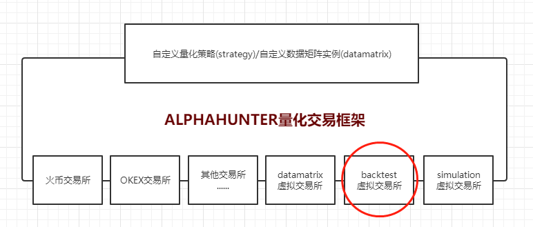

## 策略回测

本目录下包含了一些策略回测示例。

### 回测框架说明

策略回测平台利用数据库历史行情数据实现tick级别或者K线级别仿真模拟，策略回测的目的是使用不同策略参数，最终根据收益率，波动率，夏普率，回撤，换手率等多重指标，评定策略在不同参数下的不同表现，选取超参数平面上策略表现稳定区域，确定最终模型。
用户编写好的策略代码通过量化框架接入到底层backtest虚拟交易所(内部实现了回测功能)。
如下图所示：


### 回测参数配置

```json
"BACKTEST": {
    "start_time": "2020-04-20", //回测开始时间
    "period_day": "1", //回测周期,以天为单位
    "drive_type": ["kline"], //数据驱动方式,取值:kline(K线), trade(逐笔成交), orderbook(订单簿)
    "feature": {
        "huobi": { //交易平台,本例子是火币现货交易平台
            "syminfo": {
                "btcusdt": { //交易对,如果是合约就是合约名
                    "type": "spot", //现货还是合约, 取值spot(现货), future(合约)
                    "price_tick": 0.01, //价格变动最小精度
                    "size_tick": 0.0001, //下单数量变动最小精度
                    "size_limit": 0.0001, //下单数量最小限制
                    "value_tick": 1, //下单金额变动最小精度,合约交易一般不需要
                    "value_limit": 10, //下单金额最小限制,合约交易一般不需要
                    "base_currency": "BTC", //基础币种,交易标的,或者说就是'货'
                    "quote_currency": "USDT", //计价币种,一般和结算币种相同,反向合约是个例外
                    "settlement_currency": "USDT" //#结算币种,或者说就是'钱'
                },
                "ethusdt": {
                    "type": "spot",
                    "price_tick": 0.01,
                    "size_tick": 0.01,
                    "size_limit": 0.01,
                    "value_tick": 1,
                    "value_limit": 10,
                    "base_currency": "ETH",
                    "quote_currency": "USDT",
                    "settlement_currency": "USDT"
                }
            },
            "asset": { //初始资产列表
                "BTC": 10,
                "ETH": 100,
                "USDT": 10000
            },
            "maker_commission_rate": 0.002, //maker手续费
            "taker_commission_rate": 0.003  //taker手续费
        },
        "huobi_future": { //本例子是火币合约交易平台
            "syminfo": {
                "BTC200626": { //合约名
                    "type": "future",
                    "price_tick": 0.01,
                    "size_tick": 0.0001,
                    "size_limit": 0.0001,
                    "value_tick": 1,
                    "value_limit": 10,
                    "base_currency": "BTC",
                    "quote_currency": "USD",
                    "settlement_currency": "BTC",
                    "contract_size": 100, //合约大小,比如反向合约一张合约面值100USD,正向合约一张合约面值0.01BTC
                    "contract_style": "okex", //合约风格,取值okex, bitmex. okex类型合约可以多空同时持仓,四种操作:买开/卖平/卖开/买平, 而bitmex类型同一时间只能持有一个方向仓位,操作更像现货
                    "is_inverse": true //是否反向合约
                },
                "ETH200626": {
                    "type": "future",
                    "price_tick": 0.01,
                    "size_tick": 0.01,
                    "size_limit": 0.01,
                    "value_tick": 1,
                    "value_limit": 10,
                    "base_currency": "ETH",
                    "quote_currency": "USD",
                    "settlement_currency": "ETH",
                    "contract_size": 10,
                    "contract_style": "okex",
                    "is_inverse": true
                }
            },
            "asset": {
                "BTC": 10,
                "ETH": 100
            },
            "maker_commission_rate": 0.0002, //maker手续费
            "taker_commission_rate": 0.0003, //taker手续费
            "leverage": 10 //杠杆比率
        }
    }
},

```