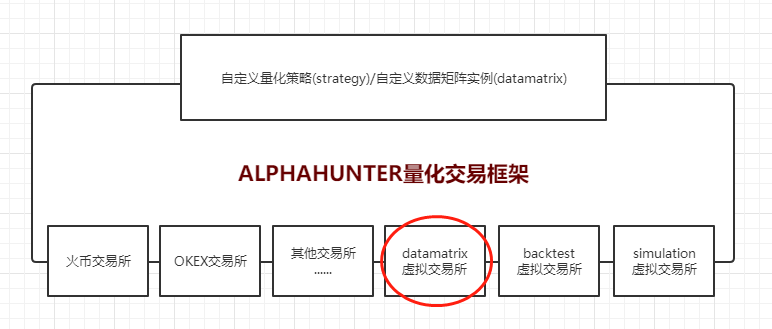

## DataMatrix数据矩阵生成

本目录下包含了一些datamatrix示例。

### DataMatrix框架说明

DataMatrix框架利用DataMatrixAPI，实现自定义DataMatrix编写。数据矩阵生成内容包括研究人员所需预测变量时间序列，利用历史行情数据，根据不同模型参数遍历数据库迭代生成的行情指标时间序列，另类事件拟合指标时间序列等预测数据。最后输出csv文件保存数据矩阵执行结果。
用户编写DataMatrix代码通过量化框架接入到底层DataMatrix处理器(类似虚拟交易所)
如下图所示：
